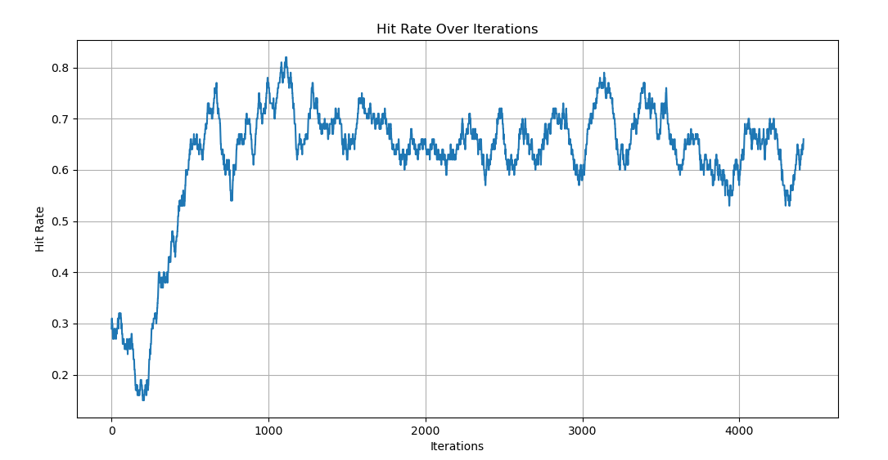
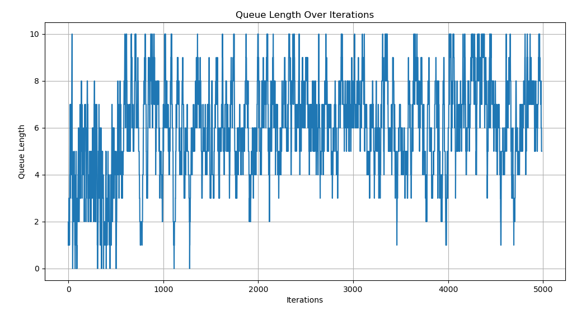
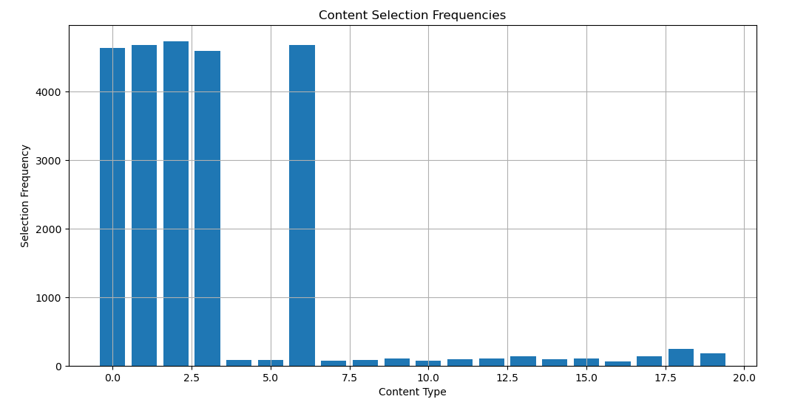
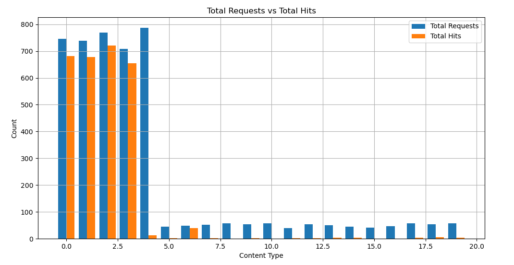
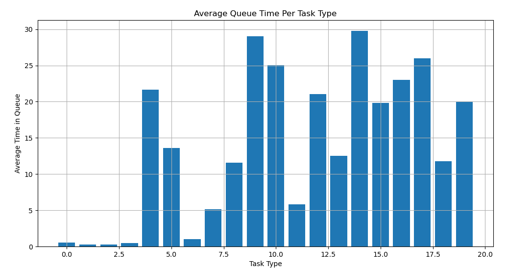

# Cache Simulation Project

### Authors: Yinxuan Wu, Ning Wang  
**Institution**: Network Science Lab, ECE Department, University of Massachusetts Amherst 

## Introduction

This project provides a reference simulation environment for students enrolled in the **ECE 627** (Fall 2024) course at UMass Amherst. The simulation is designed to model a caching system where multiple types of tasks are requested by users, and the system must manage a cache of limited size to optimize hit rates.

The current code implements a linear model-based softmax policy gradient optimization caching problem. The system simulates task requests and dynamically adjusts the cache to maximize the **cache hit rate**. The code can be expanded upon by students to further optimize additional metrics such as **computational wait queues** and **latency**, as this current version only optimizes the cache hit rate.

### Key Features:
- **Cache management**: Dynamically adjusts the cache to store 5 contents out of 20 types based on policy optimization.
- **Queue management**: Simulates a server-side queue and tracks queue length over time.
- **Policy optimization**: Uses a softmax policy gradient optimization approach with a tunable learning rate.
- **Data visualization**: Generates several plots to visualize results over iterations, including cache hit rates, queue lengths, content selection frequencies, and task requests vs. hits.

1. **Hit Rate Over Iterations**: Shows the trend of cache hit rate over time.

   

2. **Queue Length Over Iterations**: Displays how the length of the server queue fluctuates over time.

   

3. **Content Selection Frequencies**: Indicates how often each type of content was selected for caching during the simulation.

   

4. **Total Requests vs. Total Hits**: Compares the total number of requests made for each content type against the number of successful cache hits.

   

5. **Average Queue Time Per Task Type**: Shows the average time spent by each task type in the server queue.

   

## How to Run the Project

### Requirements

This project is built using Python and requires the following libraries:
- `numpy`
- `matplotlib`
- `pytest` (for running tests)

You can install the dependencies using the following command:
```bash
pip install -r requirements.txt
```

## Running the Simulation
To run the simulation, execute the following command:

```bash
python main.py
```
This will generate the figures listed above and save them to the working directory.

## Running the Tests
Unit tests are included to verify the behavior of the cache system. To run the tests, use the
```bash
pytest
```

## Docker Support
You can also run the project inside a Docker container. Make sure Docker is installed on your machine. Build and run the container using the following commands:

Build the Docker Image:
```bash
docker build -t cache_simulation .
```
Run the Container:
```bash
docker run -it cache_simulation
```

## Expanding the Project
Students in the **ECE 627** course are encouraged to build upon this project by exploring the following areas of optimization and extension:

### 1. **Queue and Latency Management**
- **Optimizing queue management**: Implement strategies to minimize the wait time for queued tasks.
- **Improving latency metrics**: Enhance latency measurements to reflect real-world systems more accurately.
- **Introducing realistic task request patterns**: Simulate varying request patterns to more closely mimic real-world network conditions.
- **Varying task complexities**: Incorporate tasks with different computational complexities to increase system dynamism.

### 2. **Network and System Scaling**
- **Increasing client-side and server-side entities**: Simulate larger systems by scaling the number of clients and servers.
- **Expanding the network topology**: Include multi-tier cache hierarchies or distributed networks to explore more intricate network structures.

### 3. **Objective Function Optimization**
- **Modifying and optimizing the objective function**: Adjust the objective function to optimize for other metrics, such as energy consumption, server load, or a combination of performance metrics.

### 4. **Reinforcement Learning Enhancements**
- **Optimizing the reward function**: Refine the reward function used in reinforcement learning to better align with desired system performance (e.g., balancing hit rate and queue time).
- **Modifying the reinforcement learning model**: Enhance the reinforcement learning algorithm by experimenting with different models.
- **Introducing multi-task reinforcement learning**: Add support for multi-task reinforcement learning to simultaneously handle multiple objectives or scenarios within the caching system.


